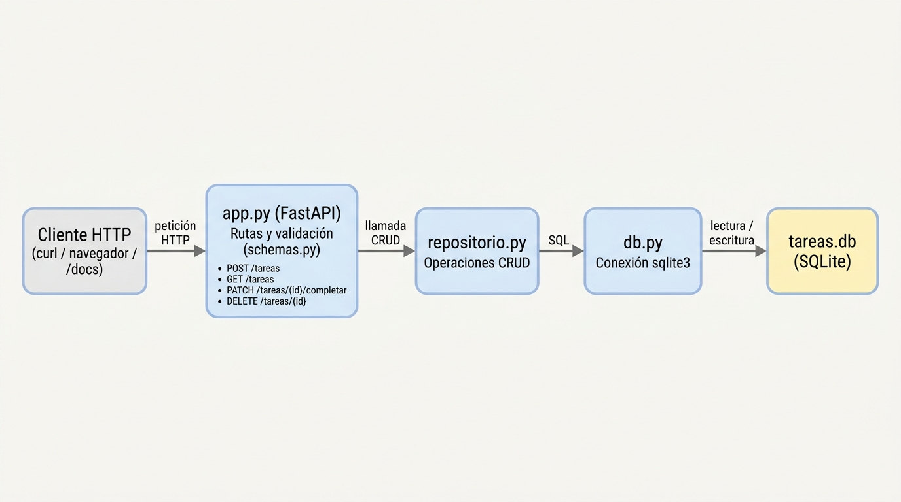

# API Tareas

API REST ligera para gestionar tareas (to-do), construida con **FastAPI** y **SQLite**. Permite crear, listar, filtrar, completar y borrar tareas a través de endpoints JSON.

---

## Requisitos

- **Python 3.11** o superior
- pip (incluido con Python)

---

## Instalación

```bash
# 1. Crear y activar el entorno virtual
python -m venv .venv
source .venv/bin/activate      # Linux / macOS
# .venv\Scripts\activate       # Windows

# 2. Instalar dependencias
pip install -r requirements.txt
```

---

## Arrancar el servidor

Cualquiera de las dos formas es válida:

```bash
# Opción A
python main.py

# Opción B (con recarga automática)
uvicorn app:app --reload
```

El servidor escucha en `http://localhost:8000`.

📖 **Documentación interactiva (Swagger UI):** <http://localhost:8000/docs>

---

## Endpoints

| Método   | Ruta                      | Descripción                          | Código de respuesta |
|----------|---------------------------|--------------------------------------|---------------------|
| `POST`   | `/tareas`                 | Crear una tarea                      | `201 Created`       |
| `GET`    | `/tareas`                 | Listar todas las tareas              | `200 OK`            |
| `GET`    | `/tareas?completada=true` | Filtrar por estado de completitud    | `200 OK`            |
| `PATCH`  | `/tareas/{id}/completar`  | Marcar una tarea como completada     | `200 OK`            |
| `DELETE` | `/tareas/{id}`            | Borrar una tarea                     | `204 No Content`    |
| `GET`    | `/salud`                  | Sonda de vida del servicio           | `200 OK`            |

> Las respuestas de error `404` devuelven `{"detalle": "Tarea no encontrada"}`.
> Los errores de validación devuelven `422 Unprocessable Entity`.
> `creada_en` se serializa en ISO 8601 UTC con microsegundos y sufijo `Z`
> (por ejemplo `2026-08-18T11:52:58.018731Z`).

---

## Ejemplos con curl

### Crear una tarea

```bash
curl -s -X POST http://localhost:8000/tareas \
  -H "Content-Type: application/json" \
  -d '{"titulo": "Comprar pan", "descripcion": "Integral"}'
```

Respuesta `201`:

```json
{
  "id": 1,
  "titulo": "Comprar pan",
  "descripcion": "Integral",
  "completada": false,
  "creada_en": "2026-08-18T11:52:58.018731Z"
}
```

### Listar todas las tareas

```bash
curl -s http://localhost:8000/tareas
```

Respuesta `200`:

```json
[
  {
    "id": 1,
    "titulo": "Comprar pan",
    "descripcion": "Integral",
    "completada": false,
    "creada_en": "2026-08-18T11:52:58.018731Z"
  }
]
```

### Filtrar tareas completadas

```bash
curl -s "http://localhost:8000/tareas?completada=true"
```

Respuesta `200`:

```json
[]
```

### Filtrar tareas pendientes

```bash
curl -s "http://localhost:8000/tareas?completada=false"
```

Respuesta `200`:

```json
[
  {
    "id": 1,
    "titulo": "Comprar pan",
    "descripcion": "Integral",
    "completada": false,
    "creada_en": "2026-08-18T11:52:58.018731Z"
  }
]
```

### Completar una tarea

```bash
curl -s -X PATCH http://localhost:8000/tareas/1/completar
```

Respuesta `200`:

```json
{
  "id": 1,
  "titulo": "Comprar pan",
  "descripcion": "Integral",
  "completada": true,
  "creada_en": "2026-08-18T11:52:58.018731Z"
}
```

### Borrar una tarea

```bash
curl -s -X DELETE http://localhost:8000/tareas/1 -w "\nHTTP %{http_code}\n"
```

Respuesta `204` (sin cuerpo):

```
HTTP 204
```

---

## Tests

```bash
pytest
```

Los tests usan una base de datos temporal para no interferir con datos reales.

---

## Variable de entorno

| Variable    | Descripción                              | Valor por defecto |
|-------------|------------------------------------------|-------------------|
| `TAREAS_DB` | Ruta del fichero de base de datos SQLite | `tareas.db`       |

Ejemplo:

```bash
TAREAS_DB=/tmp/mis_tareas.db python main.py
```

---

## Estructura de ficheros

```
api-tareas/
├── app.py              # Rutas FastAPI sobre repositorio
├── db.py               # Conexión y esquema SQLite
├── main.py             # Punto de entrada (uvicorn)
├── repositorio.py      # CRUD puro sobre la conexión
├── schemas.py          # Modelos Pydantic v2
├── requirements.txt    # Dependencias del proyecto
├── .gitignore          # Archivos ignorados por git
├── pytest.ini          # Configuración de pytest
├── conftest.py         # Fixtures: base temporal y cliente HTTP
├── test_api.py         # Tests de los endpoints HTTP (15 tests)
├── test_repositorio.py # Tests del CRUD de repositorio.py (12 tests)
├── arquitectura.md     # Diagrama de arquitectura (fuente Mermaid)
├── arquitectura.png    # Diagrama de arquitectura (imagen)
├── CONTRATO.md         # Contrato técnico de la API
├── INFORME.md          # Informe de revisión y coherencia
└── README.md           # Este fichero
```

---

## Arquitectura



La imagen se genera a partir de la fuente Mermaid de
[`arquitectura.md`](arquitectura.md), que es la version editable del diagrama.
