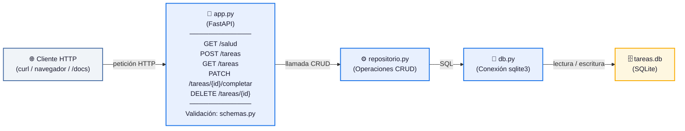

# Diagrama de Arquitectura — api-tareas

```mermaid
graph LR
    A["🌐 Cliente HTTP<br/>(curl / navegador / /docs)"] -->|"petición HTTP"| B

    B["📡 app.py<br/>(FastAPI)<br/>─────────────<br/>GET /salud<br/>POST /tareas<br/>GET /tareas<br/>PATCH /tareas/{id}/completar<br/>DELETE /tareas/{id}<br/>─────────────<br/>Validación: schemas.py"] -->|"llamada CRUD"| C

    C["⚙️ repositorio.py<br/>(Operaciones CRUD)"] -->|"SQL"| D

    D["🔌 db.py<br/>(Conexión sqlite3)"] -->|"lectura / escritura"| E

    E["🗄️ tareas.db<br/>(SQLite)"]

    style A fill:#f0f4f8,stroke:#4a6fa5,stroke-width:2px,color:#1a1a2e
    style B fill:#e8f0fe,stroke:#1a73e8,stroke-width:2px,color:#1a1a2e
    style C fill:#e8f0fe,stroke:#1a73e8,stroke-width:2px,color:#1a1a2e
    style D fill:#e8f0fe,stroke:#1a73e8,stroke-width:2px,color:#1a1a2e
    style E fill:#fef7e0,stroke:#f9ab00,stroke-width:2px,color:#1a1a2e
```
